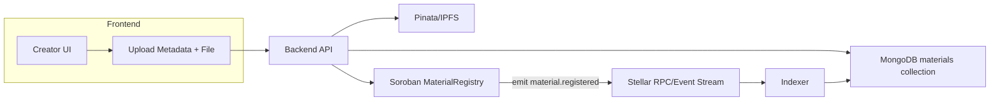
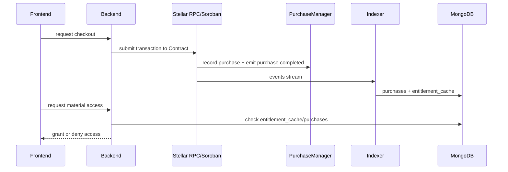

# EduVault Architecture

This document shows the high-level data and payment flow for EduVault.

## Publishing Flow (Creator)

## Checkout & Entitlement Flow (Buyer)

## Indexer Responsibilities

- Polls Stellar RPC for events related to Soroban contracts
- Writes sync events into `sync_events` to ensure idempotency
- Applies event side-effects (materials, purchases, entitlement_cache)
- On transient failures: records retry metadata in `dead_letter_events`
- Provides a `reprocess-deadletter.mjs` script for maintainers to reprocess

## Source-of-truth boundaries

- On-chain (Soroban contracts): authoritative for entitlement and payments
- MongoDB: authoritative for application catalog, caches, and derived state
- IPFS/Pinata: authoritative for file bytes and pinned metadata content

Link: see `scripts/run-stellar-indexer.mjs` and `scripts/reprocess-deadletter.mjs` for operational commands.
# EduVault Architecture

## 1. System Goals

EduVault needs to do four things reliably:

- ingest and catalog educational materials
- process low-cost purchases
- verify who is entitled to access a resource
- pay creators in a way that works across borders

## 2. Current Application Architecture

### Frontend

- Next.js App Router application
- React-based dashboard, marketplace, and onboarding flows
- Tailwind CSS styling
- Wallet connection UI for current prototype flows

### Backend

- Next.js route handlers under `src/app/api`
- JWT cookie-based session handling for profile and dashboard actions
- MongoDB for users and materials
- Nodemailer-based welcome email flow

### Storage

- document files and thumbnails uploaded through Pinata
- metadata JSON pinned to IPFS
- searchable application state stored in MongoDB

### Prototype chain layer

- EVM wallet connection via wagmi and RainbowKit
- archived ERC-721 proof of concept in `archive/legacy-evm/contracts/EduVault.sol`

## 3. Target Stellar-Native Architecture

The canonical Soroban contract boundary and event model are documented in [`docs/soroban-contract-architecture.md`](soroban-contract-architecture.md).

### Off-chain components

- `web-app`
  - creator onboarding
  - listing management
  - checkout UI
  - access verification UI
- `api`
  - material ingestion
  - metadata validation
  - entitlement-aware file delivery
  - email and notification workflows
- `indexer`
  - reads contract events from Stellar RPC/Horizon
  - synchronizes purchases and listing state into MongoDB for fast queries

### On-chain components

- `MaterialRegistry`
  - stores immutable references to content metadata
  - binds creator, rights hash, accepted-asset quotes, and payout shares
- `PurchaseManager`
  - receives payment
  - records purchase entitlement
  - routes creator and platform shares
- optional asset issuance layer
  - creator or institution-issued Stellar assets for access credits, scholarships, or cohort passes

## 4. Data Model

### Off-chain collections

- `users`
  - profile data
  - contact information
  - wallet mapping
- `materials`
  - title
  - description
  - thumbnail URL
  - IPFS metadata URL
  - creator wallet
  - search and visibility metadata
- `purchases`
  - derived cache of settled purchase events
- `entitlement_cache`
  - denormalized mirror of on-chain entitlement state for fast UI reads

### On-chain state

- material identifier
- creator account
- accepted-asset quotes
- payout shares
- rights hash
- buyer entitlement records
- platform fee and treasury parameters

## 5. Purchase Flow

1. Creator uploads content.
2. Backend pins files and metadata, then stores catalog metadata.
3. Creator registers the material on Soroban with price and asset settings.
4. Buyer initiates checkout.
5. Wallet signs a Stellar transaction.
6. `PurchaseManager` records the entitlement and handles payment routing.
7. Indexer syncs the purchase event.
8. API verifies entitlement before issuing a download response.

## 6. Security Considerations

- Keep file bytes off-chain to avoid leaking paid content.
- Use entitlement checks before download access.
- Treat MongoDB as a query cache and application store, not the source of truth for purchase rights.
- Keep payout logic on-chain where it is auditable.
- Separate issuer and distribution responsibilities if asset issuance is introduced.
- Never store private keys in the web application.

## 7. Deployment Direction

### Current

- Vercel or similar platform for the Next.js application
- managed MongoDB
- Pinata for IPFS pinning

### Planned

- Stellar testnet deployment for Soroban contracts
- production RPC/Horizon provider
- background worker for event indexing and entitlement reconciliation

## 8. Design Principle

The chain should secure settlement and rights. The web application should optimize search, onboarding, and delivery. EduVault does not need to put files on-chain to benefit from Stellar.

For the detailed storage model, invariants, accepted-asset rules, and event contract, use [`docs/soroban-contract-architecture.md`](soroban-contract-architecture.md) as the implementation reference.
